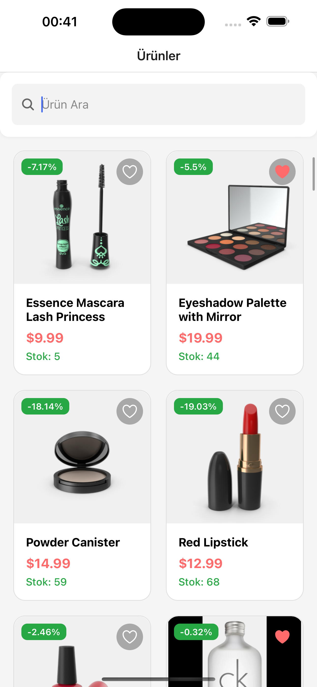
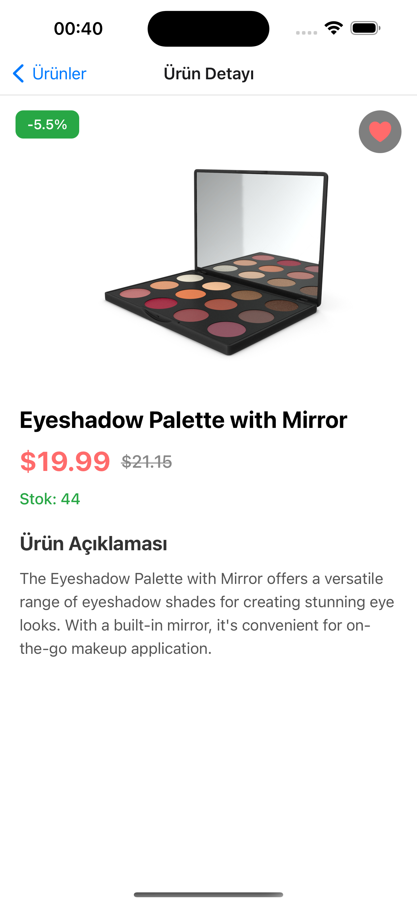
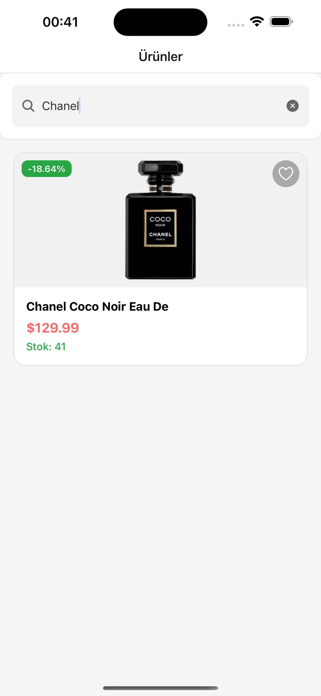
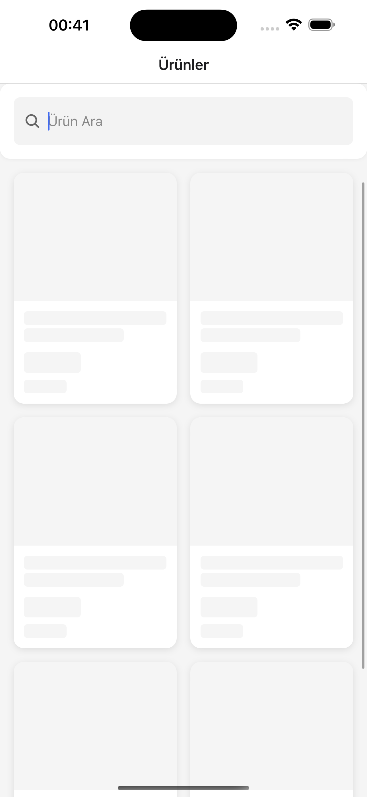

# Product Catalog

A mobile application built with React Native for browsing and searching products.

## Demo 👋

You can try the application live using the Expo link below:

[

*Note: Please install the Expo app on your device to use this link.*

## Features

- Product listing
- Search functionality with real-time filtering
- Clean and modern UI design
- Cross-platform compatibility (iOS & Android)

## Technologies Used
- React Native
- Expo
- TypeScript


## Getting Started

### Prerequisites

- Node.js (v14 or later)
- npm or yarn
- Expo CLI
- iOS Simulator (for Mac) or Android Studio (for Android development)

### Installation

1. Clone the repository
   ```bash
   git clone https://github.com/bstkpnr/ProductCatalog.git
   ```
2. Navigate to the project directory
   ```bash
   cd ProductCatalog
   ```
3. Install dependencies
   ```bash
   yarn install
   ```
4. Start the development server
   ```bash
   npx expo start
   ```
5. Run the app on iOS
   ```bash
   npx expo start --ios
   ```
6. Run the app on Android
   ```bash
   npx expo start --android
   ```

## Third-Party Libraries

- @react-native-async-storage/async-storage
- @react-navigation/bottom-tabs
- @react-navigation/native
- @react-navigation/native-stack
- @react-navigation/stack
- @reduxjs/toolkit
- axios
- expo
- expo-image
- react
- react-dom
- react-native
- react-native-safe-area-context
- react-redux
- redux-persist

### 👋
<div class="d-flex align-items-center justify-content-center" style="height: 250px;">






</div>


